# Capstone One - Accounting Ledger

## Application Greeting and Welcome Screen
___
Upon entering the application, the user is requested to input a name and whether they are using
the application for business or personal transactions. 

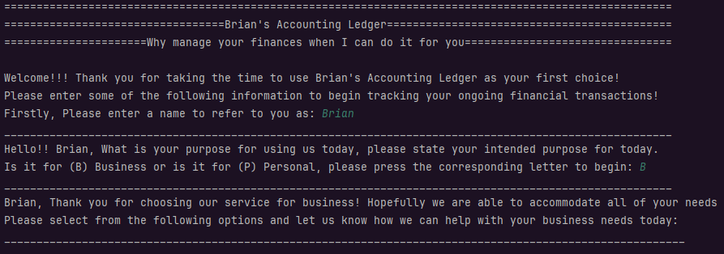

## Main Menu
___
The main menu allows to the user to choose from the four options of the application.
In this portion ***Add Deposit*** and ***Make a Payment*** will be covered, as the
ledger has more detail that will be covered in its own section.

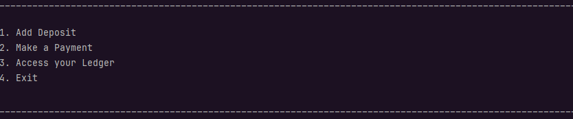

**
Add Deposit
**

When a user chooses to add a deposit they are given the following fields to log details on:

1. **Date/Time**: Immediately when choosing *Add Deposit*, user can automatically allow the 
application to log the exact date and time, if not they are allowed to enter a custom time.
2. **Description**: For the purposes of a deposit this can be whether it was a payment made to
the user or if they received money in some capacity,
3. **Vendor**: For the purpose of a deposit this would be who was paying out the transaction.
4. **Deposit Amount**: The monetary amount of the transaction.

Users will then be prompted if they want to enter another deposit, which allows them to continue.
If not they will be returned to the main menu

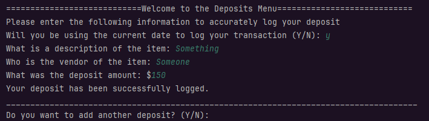

**
Make a Payment
**
When a user chooses to add a deposit they are given the following fields to log details on:

1. Date/Time: Immediately when choosing *Make a Payment*, user can automatically allow the
   application to log the exact date and time, if not they are allowed to enter a custom time.
2. Description: For the purposes of a payment this can be the product that was purchased.
3. Vendor: For the purpose of a payment this would be who the product was purchased from.
4. Payment Amount: The monetary amount of the transaction.

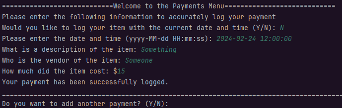

Users will then be prompted if they want to enter another payment, which allows them to continue.
If not they will be returned to the main menu

## Ledger
___
Accessing the Ledger menu offers a generalized scope of what a user may want to see.
It offers the option to print every transaction or print them out individually categorized by
_deposit_ or _payment_. A user may also access a separate ***Reports Menu*** or return to the main menu.

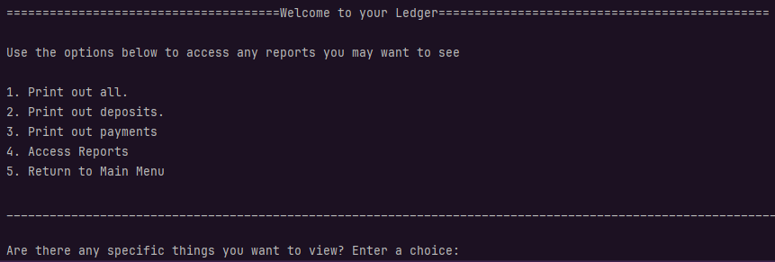

<detail>

**
Print Out All Transactions
**

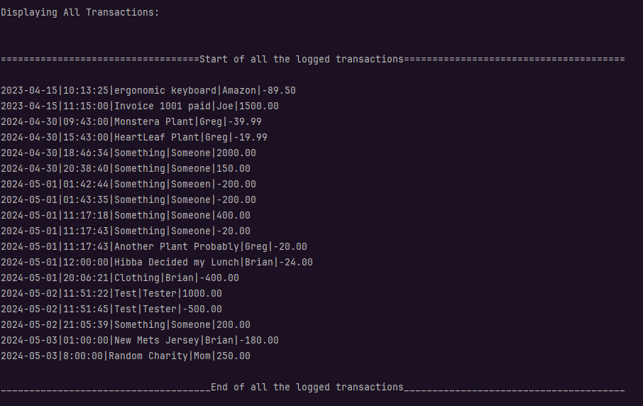

</detail>

<detail>

**
Print Out Deposits
**

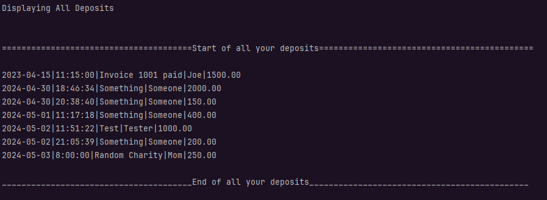

</detail>

<detail>

**
Print Out Payments
**

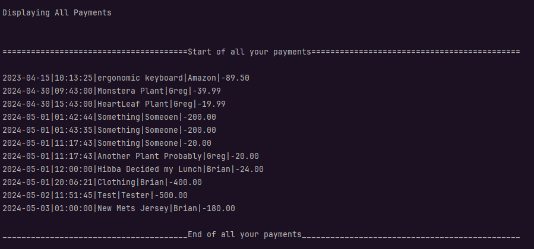

</detail>

## Access Reports
___

Accessing the Reports menu offers user further control over what they want to see. Here they
are able to print out highly specific reports from one of five options depending on what they
may be wanting to see.

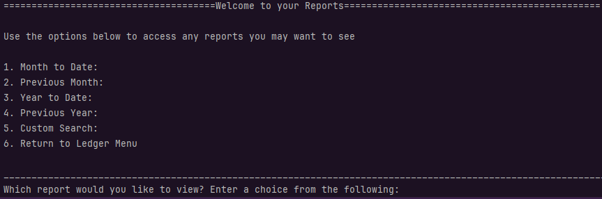

**
 Month to Date:
**

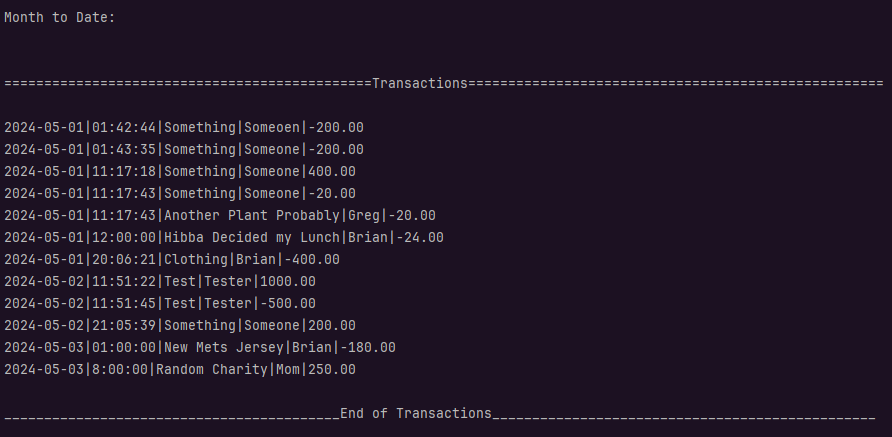

**
 Previous Month:
**

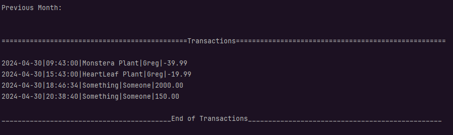

**
 Year to Date:
**

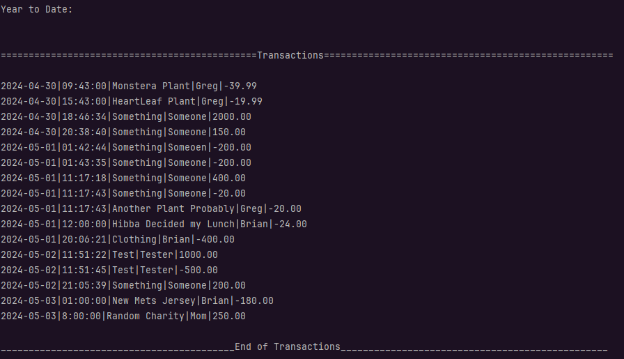

**
 Previous Year:
**

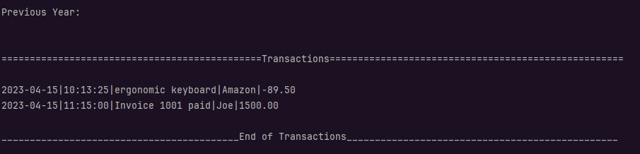

**
 Custom Search:
**

For ___Custom Search___ the user can filter along each of the following options:
1. Minimum Price
2. Maximum Price
3. Start Date
4. End Date
5. Description
6. Vendor

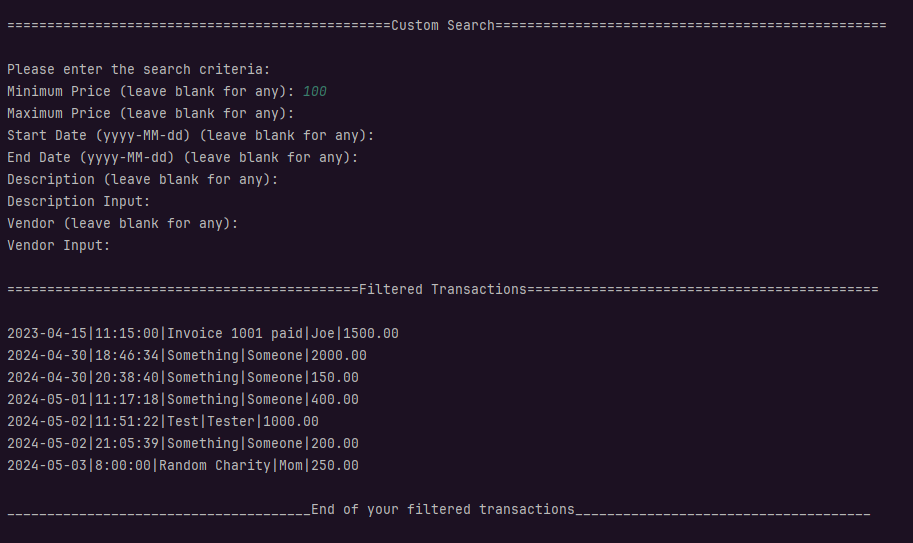

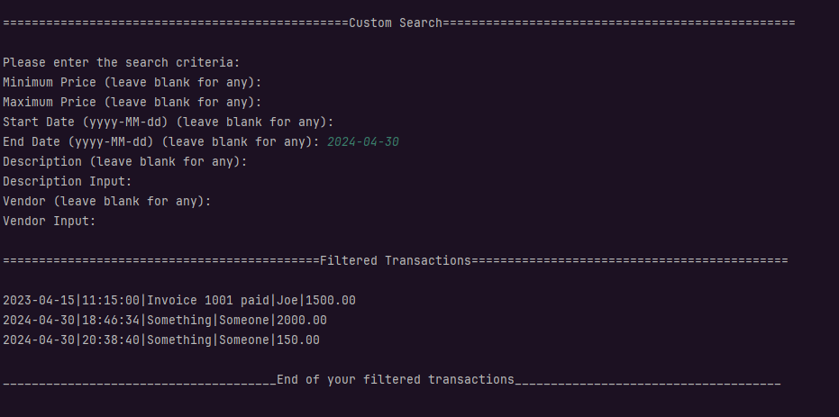

## Error Handling

Inputting an invalid option on any of the screens will display an invalid choice message
and will re-prompt the user to input a valid option:

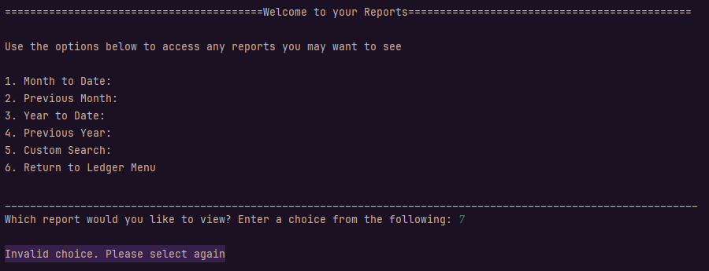

Inputting an incorrect monetary value for a deposit or payment will reset the process,
ensuring it is logged correctly:

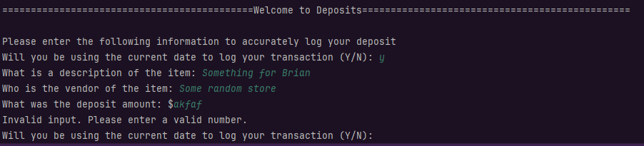

## Interesting Piece of Code

The Temporal Adjuster class was used for to generate these particular ranges for the reports.
Given that it is specifically made for date adjustments it was useful in calculating the specific
dates required.

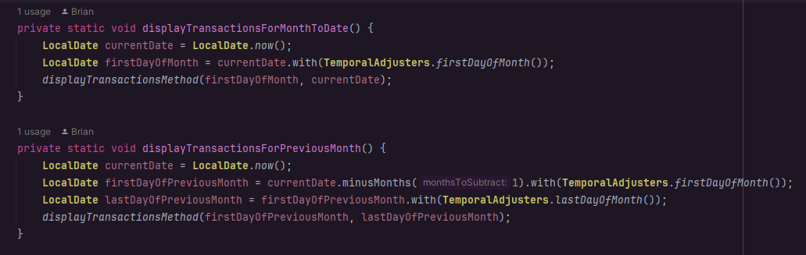

