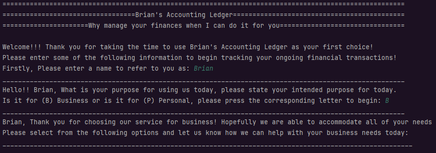
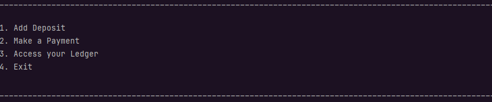
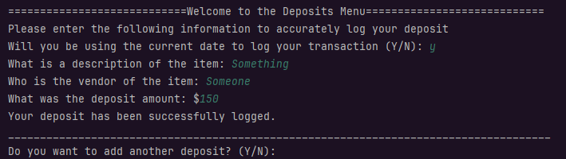
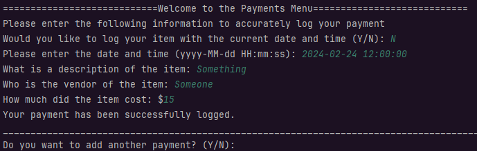

# Capstone One - Accounting Ledger

## Application Greeting and Welcome Screen
___
Upon entering the application, the user is requested to input a name and whether they are using
the application for business or personal transactions. 

## Main Menu
___
The main menu allows to the user to choose from the four options of the ledger.

**
Add Deposit
**
When a user chooses to add a deposit they are given the following fields to log details on:

1. Date/Time: Immediately when choosing *Add Deposit*, user can automatically allow the 
application to log the exact date and time, if not they are allowed to enter a custom time.
2. Description: For the purposes of a deposit this can be whether it was a payment made to
the user or if they received money in some capacity,
3. Vendor: For the purpose of a deposit this would be who was paying out the transaction.
4. Deposit Amount: The monetary amount of the transaction.

Users will then be prompted if they want to enter another deposit, which allows them to continue.

**
Make a Payment
**
When a user chooses to add a deposit they are given the following fields to log details on:

1. Date/Time: Immediately when choosing *Make a Payment*, user can automatically allow the
   application to log the exact date and time, if not they are allowed to enter a custom time.
2. Description: For the purposes of a payment this can be the product that was purchased.
3. Vendor: For the purpose of a payment this would be who the product was purchased from.
4. Payment Amount: The monetary amount of the transaction.

Users will then be prompted if they want to enter another payment, which allows them to continue.

**
Access your Ledger
**
When a user chooses to add a deposit they are given the following fields to log details on:

1. Date/Time: Immediately when choosing *Add Deposit*, user can automatically allow the
   application to log the exact date and time, if not they are allowed to enter a custom time.
2. Description: For the purposes of a deposit this can be whether it was a payment made to
   the user or if they received money in some capacity,
3. Vendor: For the purpose of a deposit this would be who was paying out the transaction.
4. Deposit Amount: The monetary amount of the transaction.

Users will then be prompted if they want to enter another deposit, which allows them to continue.

